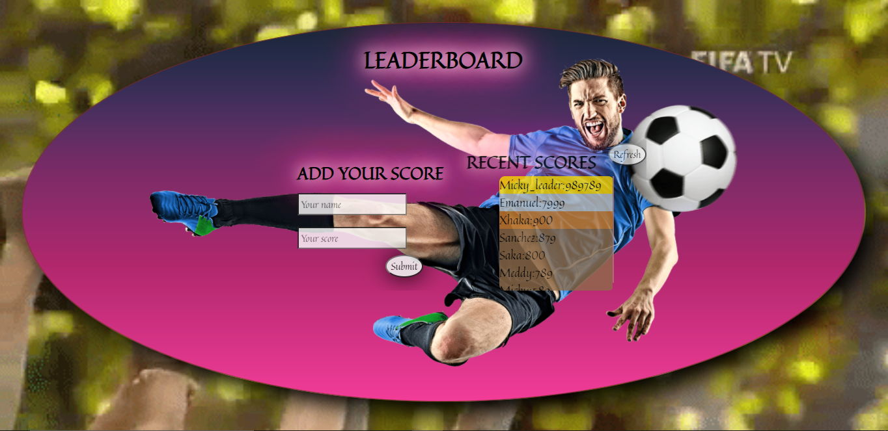

# Leaderboard_App

# Leaderboard

> The leaderboard website displays scores submitted by different players. It also allows you to submit your score. All data is preserved thanks to the external [Leaderboard API service](https://www.notion.so/microverse/Leaderboard-API-service-24c0c3c116974ac49488d4eb0267ade3).
 

### Desktop

 

### Mobile

## Live Demo
[Live Demo](https://micky373.github.io/Leaderboard_App/dist/)

## Built With

- HTML
- CSS
- Javascript
- Webpack

## Getting Started

To get a local copy up and running follow these simple example steps. 

1. Clone the project directory in your terminal by running this command:
`https://github.com/Micky373/Leaderboard_App.git`

2. Change the directory to the leaderboard:
`cd Leaderboard_App`

3. Install the project dependencies by running:
`npm install`

3. To see the homepage, run the following command:
`npm start`

4. It will open the live server in your browser at this port http://localhost:8080/

5. OBS.: It was used the Leadboard API to store and manage the data, for more information, access this [link](https://www.notion.so/microverse/Leaderboard-API-service-24c0c3c116974ac49488d4eb0267ade3)

## 👤 Author

**Michael Tamirie**

- GitHub: [MichaelTamirie](https://github.com/Micky373)
- LinkedIn: [LinkedIn](https://www.linkedin.com/in/michael-tamirie-288a331ab/)

## 🤝 Contributing

Contributions, issues, and feature requests are welcome!

Feel free to check the [issues page](https://github.com/Micky373/Leaderboard_App/issues).

## Show your support

Give a ⭐️ if you like this project!

## Acknowledgments

- A special thank for @fernandorpm for this amazing [README template](https://github.com/microverseinc/readme-template)

## 📝 License

This project is [MIT](./MIT.md) licensed.